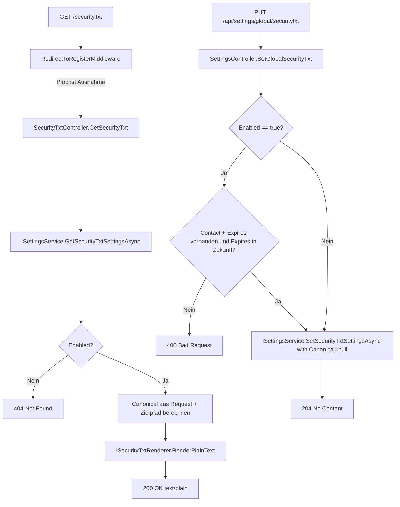

← [Zurück zur Übersicht](index.md)

# security.txt — Technischer Ablauf

## Übersicht

Eingehende öffentliche Anfragen durchlaufen die `RedirectToRegisterMiddleware`, die die security.txt-Pfade explizit von der Authentifizierungsweiterleitung ausnimmt. Der `SecurityTxtController` liest über `ISettingsService` die gespeicherte Konfiguration, setzt `Canonical` serverseitig anhand des angeforderten Ausgabeformats und delegiert die Formatierung an `ISecurityTxtRenderer`. Admin-Konfigurationsanfragen laufen über `SettingsController` mit `[Authorize(Roles = "Admin")]`.

---

## Ablauf 1: Öffentlicher Abruf von `/security.txt` oder `/.well-known/security.txt`

### 1. Middleware-Prüfung

`RedirectToRegisterMiddleware.IsExcluded` wertet den Pfad aus. Die Pfade `/security.txt`, `/.well-known/security.txt`, `/.well-known/security.md` und `/.well-known/security.html` sind als Ausnahmen eingetragen — die Middleware leitet nicht auf `/login` um.

Beteiligte Komponenten:
- `RedirectToRegisterMiddleware.IsExcluded` — Pfadbasierte Ausnahmeliste

### 2. Controller-Aufruf

`SecurityTxtController.GetSecurityTxt` wird aufgerufen (kein `[Authorize]`-Attribut auf dem Controller).

### 3. Einstellungen lesen

- `ISettingsService.GetSecurityTxtSettingsAsync` wird aufgerufen.
- `SettingsService` delegiert an `ISecurityTxtSettingsService.GetSecurityTxtSettingsAsync`.
- `SecurityTxtSettingsService` lädt alle `AppSetting`-Einträge mit den Schlüsseln `SecurityTxt.*` in einem einzigen Datenbankzugriff.
- Die Einträge werden in ein `SecurityTxtSettings`-Record gemappt:
  - `SecurityTxt.Enabled` → `bool Enabled`
  - `SecurityTxt.Expires` → `DateTimeOffset?` (geparst mit Format `"O"`, round-trip)
  - Alle übrigen Felder → `string?`

### 4. Aktivierungsprüfung

Ist `SecurityTxtSettings.Enabled == false`, gibt der Controller **HTTP 404** zurück. Kein Rendering findet statt.

### 5. Rendering

`ISecurityTxtRenderer.RenderPlainText(settings)` wird aufgerufen.

Vor dem Rendering setzt `SecurityTxtController.RenderIfEnabledAsync` die kanonische URL:
- Plain-Text-Endpunkte (`/security.txt`, `/.well-known/security.txt`) → `Canonical: https://{host}/security.txt`
- Markdown-Endpunkt → `Canonical: https://{host}/.well-known/security.md`
- HTML-Endpunkt → `Canonical: https://{host}/.well-known/security.html`

`SecurityTxtRenderer.RenderPlainText`:
- Iteriert über alle Direktiven in der Reihenfolge: `Contact`, `Expires`, `Encryption`, `Acknowledgments`, `Preferred-Languages`, `Canonical`, `Policy`, `Hiring`.
- Felder mit `null`-Wert oder Leerstring werden übersprungen.
- `Contact` und `Acknowledgments` sind Mehrfachwert-Felder (`AppendMultiline`): Der gespeicherte String wird an `\n` gesplittet; jede Zeile erzeugt eine eigene `Key: Value`-Zeile.
- Alle anderen Felder werden als einzelne `Key: Value`-Zeile ausgegeben (`AppendSingle`).

### 6. Antwort

`ContentResult` mit dem gerenderten Text und `Content-Type: text/plain; charset=utf-8`, HTTP 200.

---

## Ablauf 2: Öffentlicher Abruf von `/.well-known/security.md` oder `/.well-known/security.html`

Identisch zu Ablauf 1, außer:

- `SecurityTxtController.GetSecurityMd` ruft `ISecurityTxtRenderer.RenderMarkdown` auf → `Content-Type: text/markdown; charset=utf-8`
- `SecurityTxtController.GetSecurityHtml` ruft `ISecurityTxtRenderer.RenderHtml` auf → `Content-Type: text/html; charset=utf-8`

`SecurityTxtRenderer.RenderMarkdown`: Jede Direktive wird als `## Key`-Abschnitt mit dem Wert darunter dargestellt.

`SecurityTxtRenderer.RenderHtml`: Jede Direktive wird als `<h2>Key</h2>
Value
` dargestellt; Schlüssel- und Werttexte sind HTML-kodiert (`WebUtility.HtmlEncode`).

---

## Ablauf 3: Admin liest security.txt-Konfiguration

1. Authentifizierter Admin sendet `GET /api/settings/global/securitytxt`.
2. `SettingsController.GetGlobalSecurityTxt` prüft `[Authorize(Roles = "Admin")]`.
3. `ISettingsService.GetSecurityTxtSettingsAsync` wird aufgerufen.
4. Das `SecurityTxtSettings`-Record wird als JSON zurückgegeben (HTTP 200).

---

## Ablauf 4: Admin schreibt security.txt-Konfiguration

1. Authentifizierter Admin sendet `PUT /api/settings/global/securitytxt` mit `SecurityTxtSettings`-JSON-Body.
2. `SettingsController.SetGlobalSecurityTxt` prüft `[Authorize(Roles = "Admin")]`.
3. **Validierung** (wenn `Enabled == true`):
   - `Contact` fehlt oder ist Leerstring → HTTP 400
   - `Expires` ist `null` → HTTP 400
   - `Expires` liegt in der Vergangenheit → HTTP 400
4. `ISettingsService.SetSecurityTxtSettingsAsync(settings with { Canonical = null }, ct)` wird aufgerufen.
5. `SettingsService.SetSecurityTxtSettingsAsync` delegiert an `ISecurityTxtSettingsService.SetSecurityTxtSettingsAsync`.
6. `SecurityTxtSettingsService.SetSecurityTxtSettingsAsync`:
   - Lädt alle `SecurityTxt.*`-Einträge aus der Datenbank.
   - Führt ein Upsert durch: vorhandene Einträge werden aktualisiert, fehlende angelegt.
   - `null`-Werte löschen den zugehörigen `AppSetting`-Eintrag.
   - `SecurityTxt.Canonical` wird immer gelöscht (`Upsert(SecurityTxtCanonicalKey, null)`), damit kein manueller Canonical-Wert persistiert bleibt.
   - `Expires` wird als ISO-8601-Round-Trip-String (`"O"`-Format) gespeichert.
7. HTTP 204 No Content.

---

## Diagramm

---

## Fehlerbehandlung

| Situation | Verhalten |
|-----------|-----------|
| `Enabled == false` | Alle vier öffentlichen Endpunkte geben HTTP 404 zurück |
| `Contact` fehlt bei `Enabled = true` | `PUT`-Endpunkt gibt HTTP 400 mit Fehlermeldung zurück |
| `Expires` fehlt oder liegt in der Vergangenheit bei `Enabled = true` | `PUT`-Endpunkt gibt HTTP 400 mit Fehlermeldung zurück |
