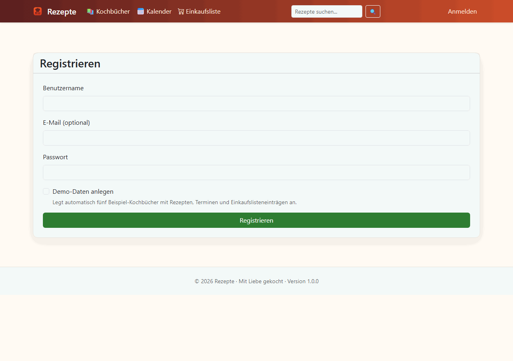

# Rezepte

[](https://github.com/martin-stromberg/Rezepte/actions)
[](LICENSE)
[](https://dotnet.microsoft.com)

Rezepte ist eine deutschsprachige Webanwendung zur Verwaltung von Kochbüchern, Rezepten, Bildern und geplanten Mahlzeiten. Das Projekt kombiniert eine Blazor-Server-Oberfläche mit JSON/API-Endpunkten, SQLite-Persistenz und optionalen KI-gestützten Importfunktionen.

## Funktionsumfang

- Benutzerregistrierung, Login und Logout mit Cookie-Authentifizierung.
- Kochbücher mit Sortierung, Detailseiten und mehreren Rezepten.
- Rezeptverwaltung mit Zutaten, Zubereitungsschritten, Bildern und Beilagen.
- Einkaufsliste, Kalenderansicht und Rezeptsuche.
- Import aus Backups, Dateien, URLs und unterstützten Webseiten.
- Plugin-Framework für Rezeptimporte und optionale KI-gestützte Imports.
- Export- und Sicherungsfunktionen inklusive Programmupdates.

Den vollständigen Funktionsumfang findest du in der [Dokumentation](Docs/features.md).

## Screenshots

Die folgenden Screenshots zeigen die Anwendung nach einer Erstregistrierung mit aktivierter Demodaten-Option:



## Tech-Stack

- .NET 10
- ASP.NET Core / Blazor Server mit Interactive Server Components
- Entity Framework Core mit SQLite
- xUnit, FluentAssertions, Moq und EF-Core InMemory für Tests
- Serilog für Console- und Datei-Logging
- QuestPDF für PDF-Erzeugung
- Google Cloud Vision und Gemini für optionale KI-Funktionen

## Voraussetzungen

- .NET SDK 10 oder neuer
- Für den Standardbetrieb keine externe Datenbank; SQLite wird lokal verwendet.
- Optional für KI-Funktionen: Gemini API-Key und bei Fotoimporten zusätzlich ein Google-Service-Account für Vision.

Details zur lokalen Einrichtung der Google-Credentials stehen im [Entwickler-Leitfaden](Docs/development-guide.md), zum Produktionsbetrieb im [Deployment-Leitfaden](Docs/deployment-guide.md).

## Lokaler Start

```powershell
dotnet restore
dotnet run --project Rezepte.Web
```

Das vorhandene Launch-Profil startet die Anwendung unter:

```text
http://localhost:5220
```

Beim ersten Start wird die SQLite-Datenbank automatisch vorbereitet. Sind EF-Core-Migrationen vorhanden, werden sie angewendet; andernfalls wird die Datenbank erstellt.

## Tests

```powershell
dotnet test
```

Details zu Testprojekten, Browser-Tests mit Playwright und dem NuGet-Sicherheitscheck findest du in [Docs/testing.md](Docs/testing.md).

## Weitere Informationen

- [Projektübersicht und Funktionsumfang](Docs/features.md)
- [Projektstruktur](Docs/project-structure.md)
- [Konfiguration](Docs/configuration.md)
- [Sicherheit und Datenschutz](Docs/security.md)
- [Tests und Qualitätssicherung](Docs/testing.md)
- [Installationsanleitung](Docs/install.md)
- [Deployment-Leitfaden](Docs/deployment-guide.md)
- [Entwickler-Leitfaden](Docs/development-guide.md)
- [Dokumentation aller Funktionsbereiche](Docs/help/index.md)
- [Anforderungskatalog](Docs/Anforderungskatalog.md)
- [Abhängigkeiten und Sicherheitsstrategie](Docs/dependencies.md)
- [Release-Notes](Docs/RELEASE_NOTES.md)
